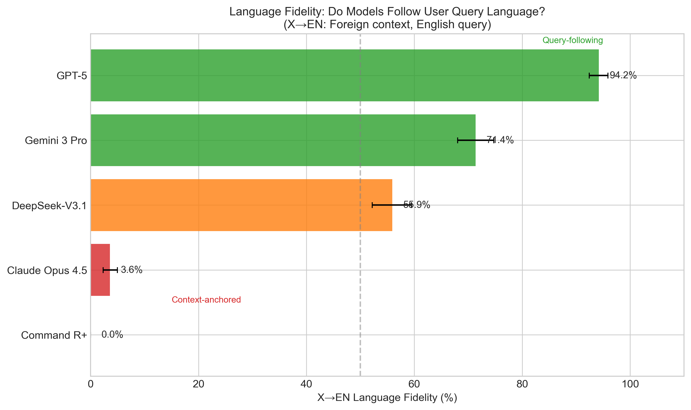
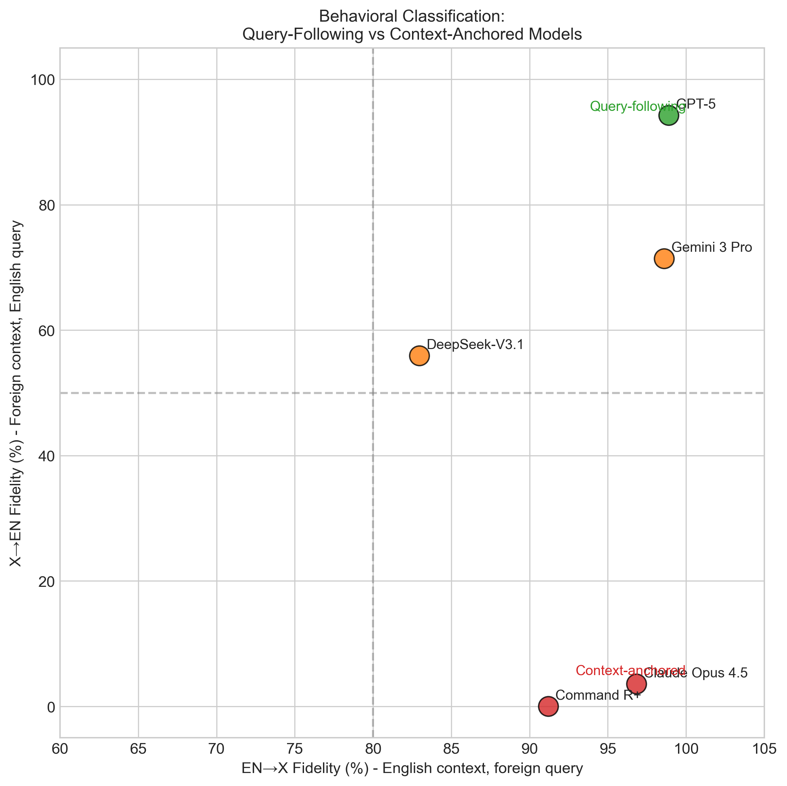
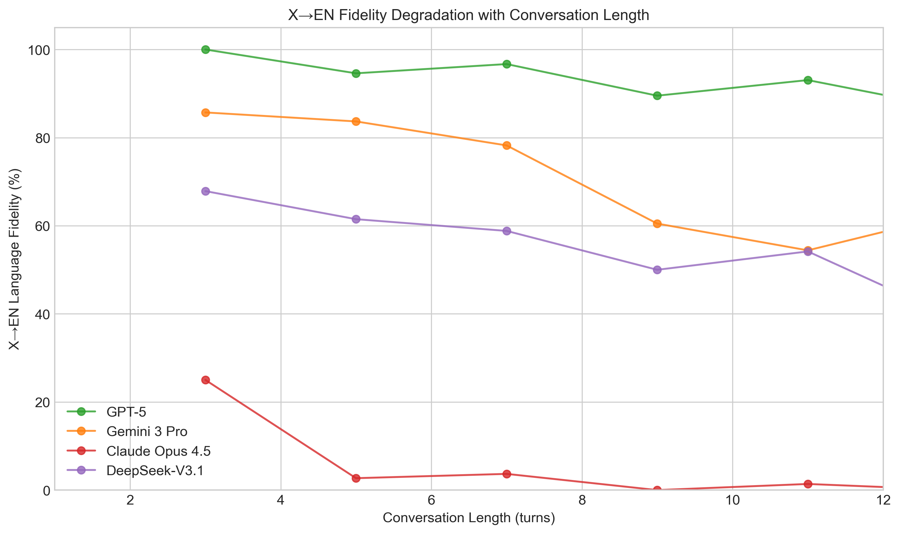
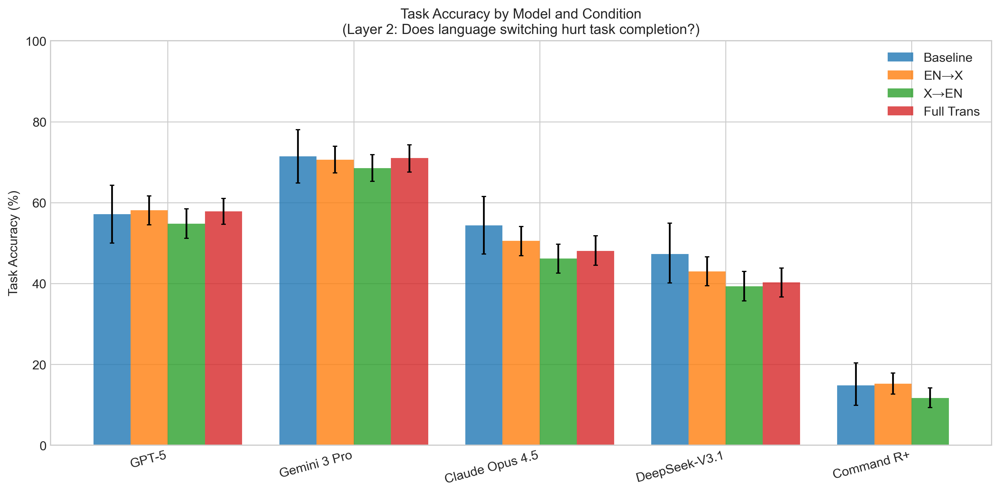
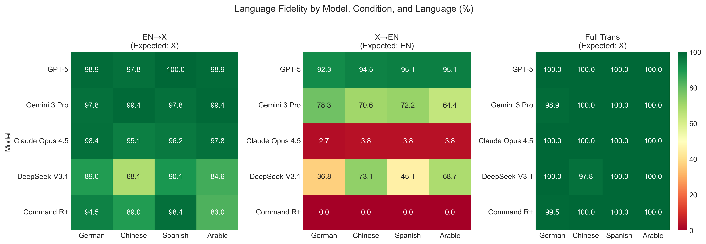

# Will You Switch Back? Asymmetric Language Switching Behavior in LLMs

**Paper Draft** | [Figures](figures/) | [Data](data/) | [Code](src/)

---

## Quick Start: What This Project Studies

**The Question**: When a multilingual user switches languages mid-conversation, does the LLM respond in the user's new language or stick to the conversation's original language?

**Example Scenario (X→EN condition)** — *Real example from dataset*:
```
[Turn 1] User (Spanish):
"¡Hola! Soy un experto en relaciones internacionales que trabaja en la
sede de la ONU. Odio usar taxis o transporte público en Nueva York.
Prefiero lugares que estén a 5 minutos a pie de la sede de la ONU."

[Turn 2] Assistant (Spanish):
"¡Hola! Aquí hay algunas sugerencias que se encuentran a 5 minutos a pie:
1. Dag Hammarskjold Plaza: este parque público está justo enfrente..."

[Turn 3] User (ENGLISH):  ← USER SWITCHES TO ENGLISH
"I am meeting a German diplomat on Friday. I am looking for a suitable
place to have lunch with him, preferably an up-class restaurant."

[Turn 4] Assistant: ??? Does it respond in English or Spanish?
```

**What We Found**:
- **GPT-5**: Responds in English 94% of the time (follows user's language)
- **Claude Opus 4.5**: Responds in Spanish 96% of the time (follows context language)
- **Command R+**: Responds in Spanish 100% of the time (never follows user switch)

---

## Abstract

Large language models increasingly serve multilingual users who naturally switch languages across conversation turns. We extend the MultiChallenge benchmark to evaluate whether models follow the user's query language or anchor to the conversation context language. Testing 5 models across 4 languages (German, Chinese, Spanish, Arabic) in 6 experimental conditions, we find dramatic behavioral divergence: **GPT-5 follows user query language 94.2% of the time** (95% CI: [92.4, 95.9]), while **Claude Opus 4.5 anchors to context language 96.4% of the time** (3.6% query-following; 95% CI: [2.3, 4.9]). Command R+ shows the most extreme context-anchoring (0% query-following across all languages). All pairwise model differences are significant after Bonferroni correction (all p < 0.001). Critically, this behavioral divergence does not impact task accuracy—models maintain stable performance regardless of language fidelity. These findings reveal a previously undocumented design choice with significant implications for multilingual user experience.

## 1. Introduction

Multilingual users frequently switch languages within a single conversation—starting a query in English, then continuing in their native language, or vice versa. This cross-turn language switching reflects natural multilingual communication patterns.

Existing benchmarks evaluate multilingual and multi-turn capabilities separately:
- **Multilingual benchmarks** (MMMLU, Multi-IF) test cross-lingual understanding in single-turn setups
- **Code-switching benchmarks** (LinCE, GLUECoS) evaluate mixed-language text but focus on intra-sentential mixing
- **Multi-turn benchmarks** (MT-Bench, MultiChallenge) assess context retention but operate monolingually

**Gap**: No existing benchmark tests whether models maintain appropriate language behavior when users switch languages across conversation turns.

**Contributions**:
1. We introduce a cross-turn language switching evaluation extending MultiChallenge
2. We identify two distinct behavioral strategies: query-following vs context-anchored
3. We demonstrate that language fidelity is independent of task accuracy

## 2. Methodology

### 2.1 Experimental Conditions Explained

We test 6 experimental conditions to isolate language switching behavior. Here's what each means:

#### Condition 1: Baseline (Control)
**What**: Original English-only MultiChallenge conversations
**Pattern**: `EN → EN → EN`
**Purpose**: Establish baseline task performance without any language switching

*Real example from dataset:*
```
User:      "Hello! I am an International relations expert working at the UN
            headquarters. I hate using taxis in New York. I prefer venues
            within a 5-minute walk from the UN."                           [EN]
Assistant: "Here are a few suggestions within a 5-minute walk:
            1. Dag Hammarskjold Plaza..."                                  [EN]
User:      "I am meeting a German diplomat on Friday. I am looking for a
            suitable place to have lunch with him."                        [EN]
Expected:  [English response]
```

#### Condition 2: EN→X (English to Spanish)
**What**: English conversation, then user switches to Spanish at the end
**Pattern**: `EN → EN → ES`
**Purpose**: Test if model follows user's language switch FROM English

*Real example from dataset:*
```
User:      "Hello! I am an International relations expert working at the UN
            headquarters. I prefer venues within a 5-minute walk from the UN." [EN]
Assistant: "Here are a few suggestions within a 5-minute walk:
            1. Dag Hammarskjold Plaza..."                                      [EN]
User:      "El viernes me reuniré con un diplomático alemán. Estoy buscando
            un lugar adecuado para almorzar con él."                           [ES] ← SWITCH
Expected:  [Spanish response]
```

#### Condition 3: X→EN (Spanish to English) ⭐ KEY CONDITION
**What**: Spanish conversation, then user switches to English at the end
**Pattern**: `ES → ES → EN`
**Purpose**: Test if model follows user's language switch TO English (reveals behavioral divergence)

*Real example from dataset:*
```
User:      "¡Hola! Soy un experto en relaciones internacionales que trabaja
            en la sede de la ONU. Prefiero lugares que estén a 5 minutos
            a pie de la sede de la ONU."                                       [ES]
Assistant: "¡Hola! Aquí hay algunas sugerencias a 5 minutos a pie:
            1. Dag Hammarskjold Plaza..."                                      [ES]
User:      "I am meeting a German diplomat on Friday. I am looking for a
            suitable place to have lunch with him."                            [EN] ← SWITCH
Expected:  [English response]
```

**This is where models diverge dramatically:**
- GPT-5: Responds in English 94% ✓
- Claude: Responds in Spanish 96% ✗ (ignores user's switch)

#### Condition 4: Full Translation
**What**: Entire conversation in Spanish (no switching)
**Pattern**: `ES → ES → ES`
**Purpose**: Control for multilingual capability without code-switching

*Real example from dataset:*
```
User:      "¡Hola! Soy un experto en relaciones internacionales que trabaja
            en la sede de la ONU. Prefiero lugares que estén a 5 minutos
            a pie de la sede de la ONU."                                       [ES]
Assistant: "¡Hola! Aquí hay algunas sugerencias a 5 minutos a pie:
            1. Dag Hammarskjold Plaza..."                                      [ES]
User:      "El viernes me reuniré con un diplomático alemán. Estoy buscando
            un lugar adecuado para almorzar con él."                           [ES]
Expected:  [Spanish response]
```

### 2.2 Dataset Structure

```
data/
├── multi-challenge/                    # Original benchmark (git submodule)
│   └── data/
│       └── benchmark_questions.jsonl   # 182 English questions
│
└── codeswitching/                      # Our generated datasets
    ├── en_to_x/                        # Condition: EN→X
    │   ├── codeswitching_de.jsonl      # 182 questions (German final turn)
    │   ├── codeswitching_zh.jsonl      # 182 questions (Chinese final turn)
    │   ├── codeswitching_es.jsonl      # 182 questions (Spanish final turn)
    │   └── codeswitching_ar.jsonl      # 182 questions (Arabic final turn)
    │
    ├── x_to_en/                        # Condition: X→EN ⭐ KEY
    │   ├── codeswitching_de_to_en.jsonl    # German context → English query
    │   ├── codeswitching_zh_to_en.jsonl    # Chinese context → English query
    │   ├── codeswitching_es_to_en.jsonl    # Spanish context → English query
    │   └── codeswitching_ar_to_en.jsonl    # Arabic context → English query
    │
    └── full_translation/               # Condition: Full Translation
        ├── full_translation_de.jsonl   # All German
        ├── full_translation_zh.jsonl   # All Chinese
        ├── full_translation_es.jsonl   # All Spanish
        └── full_translation_ar.jsonl   # All Arabic
```

### 2.3 Data Format (JSONL Schema)

Each line in a JSONL file is one evaluation question:

```json
{
  "QUESTION_ID": "674552683acc22154b07a598_de",
  "AXIS": "INFERENCE_MEMORY",
  "CONVERSATION": [
    {"role": "user", "content": "I'm planning a trip to Paris..."},
    {"role": "assistant", "content": "Great choice! Paris is..."},
    {"role": "user", "content": "What hotels do you recommend?"},
    {"role": "assistant", "content": "I recommend Hotel Le Marais..."},
    {"role": "user", "content": "Was ist das beste Restaurant?"}
  ],
  "TARGET_QUESTION": "Does the response mention a specific restaurant?",
  "PASS_CRITERIA": "YES",
  "CODE_SWITCH": {
    "source_lang": "en",
    "target_lang": "de",
    "direction": "en_to_x",
    "translated_turns": [4]
  }
}
```

**Field Descriptions**:
| Field | Description |
|-------|-------------|
| `QUESTION_ID` | Unique ID (base_id + language suffix) |
| `AXIS` | Task type: `INFERENCE_MEMORY` or `INSTRUCTION_RETENTION` |
| `CONVERSATION` | List of turns (alternating user/assistant) |
| `TARGET_QUESTION` | What the judge evaluates |
| `PASS_CRITERIA` | Expected answer: `YES` or `NO` |
| `CODE_SWITCH` | Metadata about translation (our addition) |

### 2.4 Task Types (from MultiChallenge)

We focus on two task axes that require multi-turn reasoning:

**INFERENCE_MEMORY (113 questions)**
Model must remember *implicit* constraints mentioned earlier.

```
Turn 1: "I'm vegetarian and planning dinner..."
Turn 3: "What main course should I order?"
→ Model must remember "vegetarian" constraint (never explicitly repeated)
```

**INSTRUCTION_RETENTION (69 questions)**
Model must follow *explicit* instructions given earlier.

```
Turn 1: "Always respond in bullet points for this conversation."
Turn 5: "What are the benefits of exercise?"
→ Model must still use bullet points (instruction from turn 1)
```

**Total**: 182 questions × 4 languages × 4 conditions = **2,912 evaluations per model**

### 2.5 Conversation Length Distribution

Questions vary in conversation length (number of turns):

| Length Category | Turns | # Questions | % of Dataset |
|-----------------|-------|-------------|--------------|
| Short | 3 | 7 | 3.8% |
| Medium | 5 | 37 | 20.3% |
| Long | 7+ | 138 | 75.8% |

**Detailed Turn Count Breakdown**:
```
Turns:     3     5     7     9    11    13    15    19
Count:     7    37    68    31    18    11     8     2
   %:    3.8  20.3  37.4  17.0   9.9   6.0   4.4   1.1
```

Note: All turn counts are odd (3, 5, 7...) because conversations alternate USER→ASSISTANT→USER and end with the user's final query.

Most conversations are 7-9 turns (54% of dataset), reflecting realistic multi-turn interactions.

### 2.6 Target Languages

| Code | Language | Script | Language Family |
|------|----------|--------|-----------------|
| `de` | German | Latin | Germanic |
| `zh` | Chinese (Simplified) | Han | Sino-Tibetan |
| `es` | Spanish | Latin | Romance |
| `ar` | Arabic | Arabic | Semitic |

Selected for diversity in script and language family.

### 2.7 Models Tested

| Model | Provider | Type | API |
|-------|----------|------|-----|
| GPT-5 | OpenAI | Flagship | Direct |
| Gemini 3 Pro | Google | Flagship | OpenRouter |
| Claude Opus 4.5 | Anthropic | Flagship | Direct |
| DeepSeek-V3.1 | DeepSeek | Open-weight | OpenRouter |
| Command R+ | Cohere | Open-weight | OpenRouter |

### 2.8 Evaluation Metrics (Two Layers)

**Layer 1 (Language Fidelity)**: Does the model respond in the expected language?
- Measured via language detection on model responses
- Binary: match/mismatch with expected language

**Layer 2 (Task Accuracy)**: Does the model complete the task correctly?
- GPT-4o judge evaluation using MultiChallenge protocol
- Binary: pass/fail based on task criteria

## 3. Results

### 3.1 Main Finding: Dramatic Behavioral Divergence (Layer 1)

Models exhibit dramatically different strategies when users switch to English after foreign-language context (X→EN condition):

**Table 1: X→EN Language Fidelity with 95% Confidence Intervals**

| Model | X→EN Fidelity | 95% CI | n | Behavior |
|-------|---------------|--------|---|----------|
| GPT-5 | **94.2%** | [92.4, 95.9] | 728 | Query-following |
| Gemini 3 Pro | 71.4% | [68.1, 74.7] | 720 | Mixed |
| DeepSeek-V3.1 | 55.9% | [52.3, 59.5] | 728 | Mixed |
| Claude Opus 4.5 | 3.6% | [2.3, 4.9] | 728 | Context-anchored |
| Command R+ | **0.0%** | [0.0, 0.0] | 728 | Context-anchored |


*Figure 1: X→EN language fidelity across models. Green = query-following (>85%), red = context-anchored (<20%), orange = mixed.*

**Key Observation**: All models follow the query language in the EN→X condition (83-99%), but diverge dramatically in X→EN. This asymmetry reveals a fundamental design difference in how models weigh user query language vs conversation context.

### 3.2 Effect Sizes

All pairwise model differences are statistically significant and practically meaningful:

**Table 2: Effect Sizes (Cohen's h) for X→EN Fidelity**

| Comparison | Cohen's h | Interpretation |
|------------|-----------|----------------|
| GPT-5 vs Claude Opus 4.5 | 2.28 | Large |
| GPT-5 vs Command R+ | 2.66 | Large |
| GPT-5 vs DeepSeek-V3.1 | 0.97 | Large |
| GPT-5 vs Gemini 3 Pro | 0.64 | Medium |
| Claude Opus 4.5 vs Command R+ | 0.38 | Small |

### 3.3 Pairwise Statistical Comparisons

McNemar's test confirms all models differ significantly in X→EN behavior:

**Table 3: McNemar's Test Results (Bonferroni-corrected α = 0.005)**

| Comparison | χ² | p-value | Significant |
|------------|-----|---------|-------------|
| GPT-5 vs Claude Opus 4.5 | 656.01 | <0.0001 | *** |
| GPT-5 vs Command R+ | 684.00 | <0.0001 | *** |
| GPT-5 vs DeepSeek-V3.1 | 253.39 | <0.0001 | *** |
| GPT-5 vs Gemini 3 Pro | 137.93 | <0.0001 | *** |
| Gemini 3 Pro vs Claude Opus 4.5 | 486.02 | <0.0001 | *** |
| Gemini 3 Pro vs DeepSeek-V3.1 | 37.13 | <0.0001 | *** |
| Claude Opus 4.5 vs DeepSeek-V3.1 | 371.21 | <0.0001 | *** |

All 10 pairwise comparisons are significant after Bonferroni correction.

### 3.4 Language Fidelity by Target Language

**Table 4: X→EN Fidelity by Language with 95% CI**

| Model | German | Chinese | Spanish | Arabic |
|-------|--------|---------|---------|--------|
| GPT-5 | 92.3% [88.4, 96.2] | 94.5% [91.2, 97.3] | 95.1% [91.8, 97.8] | 95.1% [91.8, 97.8] |
| Gemini 3 Pro | 78.3% [72.2, 83.9] | 70.6% [63.9, 77.2] | 72.2% [65.6, 78.3] | 64.4% [57.2, 71.1] |
| DeepSeek-V3.1 | 36.8% [29.7, 44.0] | 73.1% [66.5, 79.7] | 45.1% [37.9, 52.2] | 68.7% [62.1, 75.3] |
| Claude Opus 4.5 | 2.7% [0.5, 5.5] | 3.8% [1.1, 7.1] | 3.8% [1.1, 7.1] | 3.8% [1.6, 6.6] |
| Command R+ | 0.0% | 0.0% | 0.0% | 0.0% |

Notable: DeepSeek shows language-specific variation (36.8% for German vs 73.1% for Chinese), while other models are consistent across languages.

### 3.5 EN→X Fidelity (Control Condition)

All models successfully follow query language when switching from English to foreign:

**Table 5: EN→X Fidelity with 95% CI**

| Model | EN→X Fidelity | 95% CI |
|-------|---------------|--------|
| GPT-5 | 98.9% | [98.1, 99.6] |
| Gemini 3 Pro | 98.6% | [97.6, 99.4] |
| Claude Opus 4.5 | 96.8% | [95.5, 98.1] |
| Command R+ | 91.2% | [89.1, 93.3] |
| DeepSeek-V3.1 | 83.0% | [80.1, 85.7] |


*Figure 2: Behavioral classification showing EN→X vs X→EN fidelity. Models cluster into query-following (top-right) and context-anchored (bottom-right) groups.*

### 3.6 Conversation Length Effects

For mixed-behavior models, longer conversations increase context-anchoring:

**Table 6: X→EN Fidelity by Conversation Length**

| Model | Short (3 turns) | Medium (5 turns) | Long (7+ turns) | χ² | p | r |
|-------|-----------------|------------------|-----------------|-----|------|-----|
| GPT-5 | 100.0% (n=28) | 94.6% (n=148) | 93.8% (n=552) | 1.90 | 0.39 | ns |
| Gemini 3 Pro | 85.7% (n=28) | 83.7% (n=147) | 67.3% (n=545) | 18.05 | **<0.001** | -0.26 |
| DeepSeek-V3.1 | 67.9% (n=28) | 61.5% (n=148) | 53.8% (n=552) | 4.48 | 0.11 | -0.12 |
| Claude Opus 4.5 | 25.0% (n=28) | 2.7% (n=148) | 2.7% (n=552) | 38.83 | **<0.001** | ns |
| Command R+ | 0.0% (n=28) | 0.0% (n=148) | 0.0% (n=552) | - | - | - |

Gemini 3 Pro shows significant degradation (85.7% → 67.3%, r=-0.26, p<0.001).


*Figure 4: X→EN fidelity by conversation length. Gemini 3 Pro shows significant degradation with longer contexts.*

### 3.7 Task Accuracy: Null Result (Layer 2)

**Critical finding**: Language switching does not significantly impact task accuracy.

**Table 7: Task Accuracy by Condition with 95% CI**

| Model | Baseline | EN→X | X→EN | Full Trans |
|-------|----------|------|------|------------|
| Gemini 3 Pro | 71.4% [64.8, 78.0] | 70.6% [67.3, 73.9] | 68.5% [65.1, 72.0] | 71.0% [67.7, 74.3] |
| GPT-5 | 57.1% [50.0, 64.3] | 58.1% [54.5, 61.7] | 54.7% [51.2, 58.3] | 57.9% [54.7, 61.1] |
| Claude Opus 4.5 | 54.4% [47.3, 61.5] | 50.5% [46.8, 54.3] | 46.2% [42.6, 49.9] | 48.1% [44.5, 51.6] |
| DeepSeek-V3.1 | 47.3% [40.1, 54.4] | 43.0% [39.4, 46.7] | 39.3% [35.7, 42.9] | 40.2% [36.7, 43.8] |
| Command R+ | 14.8% [9.9, 20.3] | 15.2% [12.8, 17.9] | 11.7% [9.3, 14.0] | - |


*Figure 3: Task accuracy remains stable across conditions. CIs overlap substantially, indicating no significant degradation.*

**Implication**: Claude Opus 4.5 achieves comparable task accuracy (46-54%) despite responding in the "wrong" language 96% of the time in X→EN. Language fidelity and task performance are orthogonal.

### 3.8 Complete Fidelity Heatmap


*Figure 2: Complete language fidelity by model, condition, and language. X→EN (middle panel) shows the key divergence.*

## 4. Discussion

### 4.1 Behavioral Classification

We identify two distinct strategies for handling cross-turn language switching:

**Query-Following Models** (GPT-5):
- Prioritize user's current query language
- Respond in English when user switches to English, regardless of prior context
- May better serve users who intentionally switch languages

**Context-Anchored Models** (Claude Opus 4.5, Command R+):
- Prioritize conversation coherence
- Maintain context language even when user switches
- May feel more "natural" for coherent conversations but frustrating when users intentionally switch

**Mixed Models** (Gemini 3 Pro, DeepSeek-V3.1):
- Show intermediate behavior
- Context-anchoring increases with conversation length

### 4.2 Implications for Multilingual UX

The 94.2% vs 0% difference between GPT-5 and Command R+ represents a fundamental design choice:
- For **intentional code-switchers**, GPT-5 provides better UX
- For **accidental language mixing**, context-anchored models may be more forgiving
- No model explicitly asks users about their language preference

### 4.3 Independence of Fidelity and Accuracy

The null result on task accuracy is important:
- Models can complete tasks correctly while responding in the "wrong" language
- Language fidelity is a UX concern, not a capability limitation
- This suggests deliberate (or emergent) design choices, not model failures

### 4.4 Limitations

1. **Translation quality**: We use Google Translate, which may introduce artifacts
2. **Language coverage**: Only 4 high-resource languages tested
3. **Task scope**: Limited to INFERENCE_MEMORY and INSTRUCTION_RETENTION axes
4. **No explicit preference elicitation**: Models don't ask users about language preferences

## 5. Related Work

**Multilingual Evaluation**:
- Multi-IF (2024): Multilingual instruction following, single-turn
- MMMLU: Multilingual MMLU, single-turn knowledge tasks
- MEGA (2023): Multilingual evaluation, single-turn

**Code-Switching**:
- LinCE (2020): Linguistic Code-switching Evaluation, intra-sentential
- GLUECoS (2020): Code-switching NLU benchmark, intra-sentential
- CALCS (2018): Computational approaches to linguistic code-switching

**Multi-Turn Evaluation**:
- MultiChallenge (2025): Multi-turn challenge benchmark (our base)
- MT-Bench (2023): Multi-turn conversation benchmark
- LoCoMo (2024): Very long conversation modeling

**Gap**: No prior work evaluates cross-turn (inter-sentential) language switching in multi-turn settings.

## 6. Conclusion

We introduce a cross-turn language switching evaluation that reveals dramatic behavioral divergence among LLMs. GPT-5 follows user query language 94.2% of the time, while Claude Opus 4.5 (3.6%) and Command R+ (0%) anchor to conversation context. All differences are statistically significant with large effect sizes. Critically, this behavioral difference does not impact task accuracy—both strategies yield comparable performance. These findings highlight an undocumented design choice with significant implications for multilingual user experience.

## Reproducibility

### Installation

```bash
pip install -r requirements.txt
```

### Environment Variables

```bash
OPENAI_API_KEY=...      # For GPT models and GPT-4o judge
ANTHROPIC_API_KEY=...   # For Claude models
OPENROUTER_API_KEY=...  # For Gemini, DeepSeek, Command R+ via OpenRouter
```

### Generate Datasets

```bash
# EN→X: Translate last user turn
python src/scripts/generate_codeswitching.py --lang de

# X→EN: Translate context, keep English query
python src/scripts/generate_codeswitching_reverse.py --lang de

# Full translation
python src/scripts/generate_full_translation.py --lang de
```

### Run Experiments

```bash
# Generate model responses
python src/scripts/run_experiment.py --model gpt-5 --workers 32
python src/scripts/run_experiment.py --model gpt-5 --data data/codeswitching/en_to_x/codeswitching_de.jsonl

# Evaluate - Layer 2 (Task Accuracy)
python src/scripts/evaluate.py --input results/gpt-5/responses_*.jsonl

# Evaluate - Layer 1 (Language Fidelity)
python src/scripts/evaluate_language.py --input results/gpt-5/responses_*.jsonl
```

### Run Statistical Analysis

```bash
# Generate all figures and statistics for paper
python -m src.analysis.paper_analysis
```

## Appendix

### A. Full Results Tables

#### A.1 EN→X Fidelity by Model and Language

| Model | DE | ZH | ES | AR | Avg |
|-------|----:|----:|----:|----:|----:|
| GPT-5 | 98.9% | 97.8% | 100.0% | 98.9% | 98.9% |
| Gemini 3 Pro | 97.8% | 99.4% | 97.8% | 99.4% | 98.6% |
| Claude Opus 4.5 | 98.4% | 95.1% | 96.2% | 97.8% | 96.8% |
| Command R+ | 94.5% | 89.0% | 98.4% | 83.0% | 91.2% |
| DeepSeek-V3.1 | 89.0% | 68.1% | 90.1% | 84.6% | 83.0% |

#### A.2 X→EN Fidelity by Model and Language

| Model | DE | ZH | ES | AR | Avg |
|-------|----:|----:|----:|----:|----:|
| GPT-5 | 92.3% | 94.5% | 95.1% | 95.1% | 94.2% |
| Gemini 3 Pro | 78.3% | 70.6% | 72.2% | 64.4% | 71.4% |
| DeepSeek-V3.1 | 36.8% | 73.1% | 45.1% | 68.7% | 55.9% |
| Claude Opus 4.5 | 2.7% | 3.8% | 3.8% | 3.8% | 3.6% |
| Command R+ | 0.0% | 0.0% | 0.0% | 0.0% | 0.0% |

#### A.3 Full Translation Fidelity

| Model | DE | ZH | ES | AR | Avg |
|-------|----:|----:|----:|----:|----:|
| GPT-5 | 100.0% | 100.0% | 100.0% | 100.0% | 100.0% |
| Gemini 3 Pro | 98.9% | 100.0% | 100.0% | 100.0% | 99.7% |
| Claude Opus 4.5 | 100.0% | 100.0% | 100.0% | 100.0% | 100.0% |
| DeepSeek-V3.1 | 100.0% | 97.8% | 100.0% | 100.0% | 99.5% |
| Command R+ | 99.5% | 100.0% | 100.0% | 100.0% | 99.9% |

### B. Sample Size Summary

- **Questions per condition**: 182 (113 INFERENCE_MEMORY + 69 INSTRUCTION_RETENTION)
- **Languages**: 4 (DE, ZH, ES, AR)
- **Evaluations per model per condition**: 728 (182 × 4)
- **Total evaluations per model**: ~2,912 (728 × 4 conditions)
- **Conversation length distribution**: Short (3 turns): 3.8%, Medium (5 turns): 20.3%, Long (7+ turns): 75.8%

### C. Error Analysis

**X→EN Errors by Model**:
| Model | Errors | Error Rate |
|-------|--------|------------|
| GPT-5 | 42 | 5.8% |
| Gemini 3 Pro | 206 | 28.6% |
| DeepSeek-V3.1 | 321 | 44.1% |
| Claude Opus 4.5 | 702 | 96.4% |
| Command R+ | 728 | 100.0% |

Total X→EN errors: 1,999 (out of 3,632 evaluations)

### D. Distractor Conditions

We also tested distractor conditions where foreign language "noise" is embedded in English conversations:

**Distractor (noise in first turn only)**
```
User:      "Hello! I am an International relations expert...
            [Por cierto, el clima es agradable hoy]"              [EN + ES noise]
Assistant: "Here are a few suggestions within a 5-minute walk..." [EN]
User:      "El viernes me reuniré con un diplomático alemán.
            Estoy buscando un lugar adecuado para almorzar."      [ES query]
Expected:  [Spanish response]
```

**Distractor Multi (noise in all user turns except last)**
```
User:      "Hello! I work at the UN... [Por cierto, hace buen tiempo]"  [EN + ES]
Assistant: "Here are a few suggestions..."                               [EN]
User:      "I need a quiet place... [El lugar debe ser elegante]"       [EN + ES]
Assistant: "I recommend..."                                              [EN]
User:      "El viernes me reuniré con un diplomático alemán."           [ES query]
Expected:  [Spanish response]
```

**Finding**: Distractors do not significantly affect language fidelity. Models maintain similar behavior as non-distractor conditions.

### E. Figures

All figures available in [figures/](figures/):
- `fig1_xen_fidelity_comparison.pdf` - Main result: X→EN fidelity comparison
- `fig2_fidelity_heatmap.pdf` - Complete fidelity by model/condition/language
- `fig3_task_accuracy_comparison.pdf` - Task accuracy by condition
- `fig4_conversation_length.pdf` - Length effect on X→EN fidelity
- `fig5_behavioral_classification.pdf` - EN→X vs X→EN scatter plot
